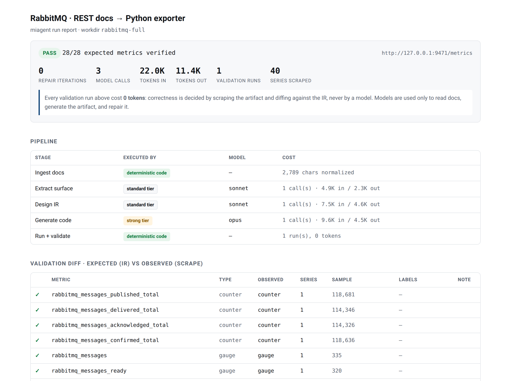
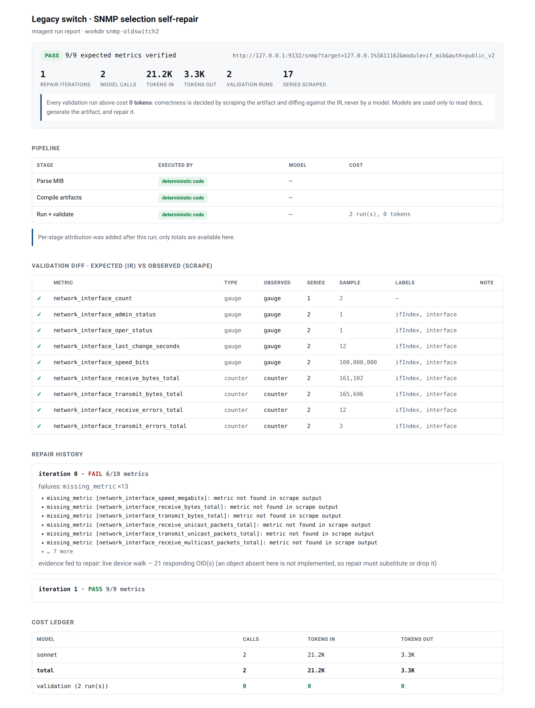
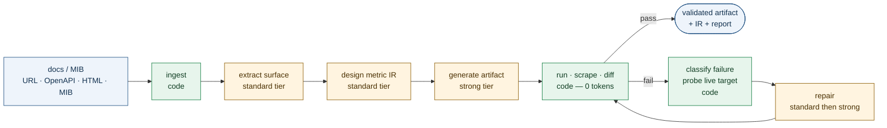

# monitoring-integration-agent

> An agent that writes Prometheus exporters and `snmp_exporter` configs from API
> documentation and MIBs — then **proves they work by running them** and diffing the
> scraped metrics against a machine-checkable spec.

[](https://github.com/joun-kazmi/monitoring-integration-agent/actions/workflows/tests.yml)
[](LICENSE)


<picture>
  <source media="(prefers-color-scheme: dark)" srcset="docs/img/report-hero-dark.png">
  
</picture>

Writing a monitoring integration is mostly a translation problem: read an API's
docs or a device's MIB, decide which fields are worth recording, name them to
Prometheus conventions, and write the code that exposes them. An LLM is good at
that translation and bad at knowing whether it got it right.

So this agent never asks a model whether the output is correct. It **runs** the
generated artifact against the real endpoint, scrapes it, and diffs the result
against an intermediate representation the model committed to earlier. A model
that hallucinates a field produces a metric that isn't there, and the harness
says so — by name.

**Validation costs zero tokens**, which is the design's load-bearing
consequence: iteration is free, so the loop can afford to run as many times as
it takes, and a catalog of integrations can be re-verified on a schedule for
nothing.

## Results

Five real runs, all verified against live endpoints. Every artifact and
validation report is committed under [`examples/runs/`](examples/runs).

| Scenario | Result | Repairs | Model calls | Tokens | Report |
|---|---|---|---|---|---|
| RabbitMQ REST API → Python exporter | **PASS** 28/28 metrics | 0 | 3 | 22.0K in / 11.4K out | [view](docs/reports/rabbitmq.html) |
| RabbitMQ, after an upstream API change | **PASS** 28/28 metrics | 1 | 1 | 13.7K in / 6.0K out | [view](docs/reports/rabbitmq-self-repair.html) |
| RabbitMQ, docs fetched over HTTP | **PASS** 27/27 metrics | 0 | 3 | 15.8K in / 13.4K out | [view](docs/reports/rabbitmq-from-url.html) |
| IF-MIB device → `snmp_exporter` config | **PASS** 18/18 metrics | 0 | 1 | 8.9K in / 3.3K out | [view](docs/reports/snmp-ifmib.html) |
| Legacy switch with no `ifXTable` | **PASS** 9/9 metrics | 1 | 2 | 21.2K in / 3.3K out | [view](docs/reports/snmp-legacy-switch.html) |

Two of those are the interesting ones.

**Recovering from an upstream API change.** A working RabbitMQ integration was
broken by renaming a response field and nesting another — the kind of drift that
silently empties dashboards. Validation caught it, repair was handed fresh
samples of the live endpoint as ground truth, and the fixed exporter tolerates
both shapes. One model call, 45 seconds.

**A device that doesn't implement what the model wanted.** Asked to monitor a
legacy switch, the agent picked 64-bit interface counters — which that device
lacks entirely. Repair walked the device, saw which OIDs actually respond, and
substituted the 32-bit equivalents instead of quietly dropping throughput
coverage.

<picture>
  <source media="(prefers-color-scheme: dark)" srcset="docs/img/self-repair-dark.png">
  
</picture>

## How it works



Green is deterministic code, amber is a model call, and the loop between them
is free to run as often as it needs to.

The IR produced at stage 3 is the contract: generation targets it, validation
enforces it, and nothing else is trusted. Failures are classified
deterministically — `auth_error`, `missing_metric`, `type_mismatch`,
`label_mismatch`, `value_implausible` — so a repair receives a categorized
problem plus real evidence from the target, not a stack trace.

For SNMP the shape is tighter still: **one model call for the whole
integration.** The MIB is parsed deterministically, the model only chooses which
objects matter and what to call them, and `snmp.yml`, `generator.yml` and the
validation IR are all *compiled* from that single selection — so the artifact
and its expectations cannot drift apart.

## Cost engineering

Stages map to model tiers, and the repair loop escalates only when cheap
attempts fail. Nothing in the pipeline is hardcoded to one vendor.

| Stage | Executed by | Why |
|---|---|---|
| Ingest, parse, compile, validate | **deterministic code** | No judgment required — and it makes iteration free |
| Classify document type | fast tier (haiku) | Only when content sniffing is ambiguous |
| Extract metric surface, design IR | standard tier (sonnet) | Structured extraction against a schema that validates it |
| Generate exporter code | strong tier (opus) | A bad artifact costs an entire validate-and-repair cycle |
| Repair, iterations 1–2 | standard tier | Most failures are shallow: a wrong path, a renamed field |
| Repair, iteration 3+ | strong tier | Escalates automatically after `MIAGENT_ESCALATE_AFTER` |

Convention enforcement lives in code rather than prompts, because prompts are
probabilistic: counters are forced to end in `_total`, and SNMP time types get
`_seconds` plus a `scale: 0.01` factor. During testing a model named a
centisecond value `_seconds` — wrong by 100×, and invisible to structural
validation. The compiler now fixes that deterministically.

## LLM backends

Selected with `MIAGENT_LLM_BACKEND`. **The default needs no API key**, using a
local Claude Code login.

| Backend | Auth | Notes |
|---|---|---|
| `claude_cli` *(default)* | local Claude Code login | shells out to `claude -p`; no key required |
| `anthropic` | `ANTHROPIC_API_KEY` | native structured outputs |
| `openai` | `MIAGENT_API_KEY` + `MIAGENT_BASE_URL` | any OpenAI-compatible host: OpenAI, OpenRouter, vLLM, Ollama |

```bash
# example: route the tiers through OpenRouter
export MIAGENT_LLM_BACKEND=openai
export MIAGENT_API_KEY=sk-or-...
export MIAGENT_BASE_URL=https://openrouter.ai/api/v1
export MIAGENT_MODEL_FAST=anthropic/claude-haiku-4.5
export MIAGENT_MODEL_STANDARD=anthropic/claude-sonnet-5
export MIAGENT_MODEL_STRONG=anthropic/claude-opus-5
```

## Quickstart

```bash
git clone https://github.com/joun-kazmi/monitoring-integration-agent
cd monitoring-integration-agent
pip install -e .            # or just use PYTHONPATH=src, as below

# verify the LLM backend with one cheap call
PYTHONPATH=src python3 -m miagent.cli llm-smoke

# start a stand-in RabbitMQ management API, then generate against it
python3 examples/rabbitmq/mock_server.py 15672 &
MIAGENT_TARGET_USERNAME=guest MIAGENT_TARGET_PASSWORD=guest \
PYTHONPATH=src python3 -m miagent.cli generate \
    --service rabbitmq --docs examples/rabbitmq/docs.md \
    --target http://127.0.0.1:15672 \
    --workdir build/rabbitmq

# render that run as a self-contained HTML report
PYTHONPATH=src python3 -m miagent.cli report build/rabbitmq -o report.html
```

Other commands: `generate-snmp` (MIB → validated `snmp_exporter` config),
`repair` (re-validate an existing artifact, repair only if it drifted),
`ingest` (fetch and normalize docs, no LLM), `validate` (diff a scrape against
an IR spec).

```bash
PYTHONPATH=src python3 -m pytest tests/ -q    # 53 tests
```

## Run reports

Every run writes its artifacts to disk — the IR, the generated artifact,
per-iteration validation results, the device walks fed to repair, and a
per-stage token ledger. `miagent report` renders those into one self-contained
HTML page: no server, no external assets, no model calls.

```bash
# one run
PYTHONPATH=src python3 -m miagent.cli report build/rabbitmq -o report.html

# rebuild the whole committed set plus its index
PYTHONPATH=src python3 -m miagent.cli report --manifest docs/reports.manifest.json
```

Because validation is deterministic, those pages are reproducible: re-run
`miagent validate` against the same target and you get the same verdict.

## What's proven, and what isn't

The interesting claim here is the validation loop, and that part is genuinely
proven. The rest deserves an honest accounting:

- **The SNMP path is verified against third-party inputs** — real IF-MIB
  compiled by `pysmi`, validated against `snmpsim`'s bundled device data. None
  of it authored by me.
- **The REST path was verified against a mock I wrote myself**, from a docs
  excerpt I also wrote. The machinery demonstrably works, but it has not yet
  faced a service whose docs and response shapes I didn't choose. Doc
  *ingestion* has been exercised on genuinely foreign input: the live Swagger
  Petstore spec and rabbitmq.com's HTML reference.
- **Auth: basic, bearer, API-key header and query-param tokens.** Each
  endpoint's IR `auth` scheme is honored by both the generated exporter and
  the repair-stage probe; the token comes from `MIAGENT_TARGET_TOKEN`.
  `auth=none` endpoints never get credentials, and credentials are only sent
  to the `--target` origin (the probe refuses other hosts). Endpoints and
  their auth come verbatim from the extraction stage; schema design can't
  change them. Not covered: OAuth2 flows (token acquisition/refresh), mTLS, request signing
  (AWS SigV4 and friends), and cookie/session login.
- **No pagination handling.** One GET per endpoint. A paginated collection
  would silently yield page 1 — and validation would *pass*, because the
  metrics do exist. A green check on degraded output is the failure mode this
  design has to keep watching for.
- **Cardinality is flagged, not prevented.** Validation warns when one metric
  exceeds `MIAGENT_MAX_SERIES_PER_METRIC` (1000) series or all metrics together
  exceed `MIAGENT_MAX_SERIES_TOTAL` (10000), naming the label with the most
  distinct values. It's a warning because the IR's labels are the contract:
  trimming them is a schema decision for a human, not something repair should
  do to get a green check.
- **SNMP v2c only**, one module per run.
- **Generated code is sandboxed for files, not for network.** The REST path
  runs LLM-written Python with a scrubbed environment (no API keys or cloud
  credentials) and CPU/memory limits. With [bubblewrap](https://github.com/containers/bubblewrap)
  installed (`MIAGENT_SANDBOX=auto`, the default), it also runs with a read-only
  filesystem, home directories, `/tmp` and `/run/user` hidden, and only its
  workdir writable. Without bwrap it runs unsandboxed with a warning; set
  `MIAGENT_SANDBOX=bwrap` to make that an error. The network is **not**
  restricted in either case, and process count isn't capped. Treat docs you
  feed it as code you'd run. Two consequences worth stating plainly:
  - Generated code holds the real target credentials and has network access,
    so prompt-injected code could send them anywhere. Network allowlisting
    (target only) is the prerequisite for any untrusted-docs or service mode,
    ahead of further filesystem hardening.
  - Read-only protects integrity, not confidentiality: host-readable files
    outside the hidden trees (`/etc`, `/opt`, `/srv`, other mounts) remain
    readable inside the sandbox.
- **Trusted-operator tool, not a service.** Doc ingestion, endpoint probing
  and validation fetch whatever URLs they're given (ingestion follows
  redirects), from your machine's network position. That's intended for a
  local CLI. Before exposing it to other callers (API, bot, CI on untrusted
  PRs), add a central URL policy that blocks loopback, link-local/metadata
  (169.254.0.0/16) and private ranges, re-checked after each redirect, or
  it becomes an SSRF proxy.
- **Repair sends live API responses to the LLM.** Up to 3 KB of each probed
  endpoint's body goes into the repair prompt, so with an API-backed LLM,
  target data leaves the machine. By default (`--live-samples redacted`)
  bodies get **best-effort pattern redaction, not a confidentiality
  boundary**: labeled by path only; secret-named fields (`password`, `token`,
  `api_key`, `cookie`, `auth`...) dropped whatever their type; host-named
  fields (`host`, `node`, `peer`, `address`, `ip`...) masked; strings shaped
  like URLs, emails, IPs, FQDNs, UUIDs or long tokens masked; lists trimmed
  to 3 items. Anything else passes through, including queue names and hosts
  in unexpected fields or formats. Use `--live-samples off` when target data
  must not leave the machine (repair then works from logs alone), or `raw`
  to send bodies unmodified.
- **Target credentials travel by environment.** Prefer
  `MIAGENT_TARGET_USERNAME` / `MIAGENT_TARGET_PASSWORD` over `--username` /
  `--password` (argv is visible in `ps`). Generated exporters receive them the
  same way and never on their command line.

[`docs/HANDOFF.md`](docs/HANDOFF.md) has the full roadmap, including the two
substantial items not yet built: the **OTel collector path** (declarative config
rather than bespoke code — cheaper to generate, and what most teams would rather
deploy) and **fleet mode** (validate hundreds of integrations for free, spending
tokens only on the ones that broke).

## Layout

```
src/miagent/
  ingest.py          # stage 1: fetch + sniff + normalize docs (no LLM)
  ir.py              # the metric IR — contract between generation and validation
  orchestrate.py     # pipeline state machines + validate/repair loops
  runner.py          # shared process launch/scrape/teardown + endpoint probing
  report.py          # run workdir -> self-contained HTML (no LLM)
  llm/               # backends (claude_cli | anthropic | openai) + tier router
  validate/          # deterministic harness: scrape, lint, parse, diff
  snmp/              # MIB parsing; selection -> snmp.yml / generator.yml / IR
  stages/            # the LLM-facing stages and their prompts
examples/
  runs/              # committed run records — the evidence behind the table above
  rabbitmq/          # mock management API (--break mode forces a repair)
  snmp/              # snmpsim device fixtures
docs/reports/        # rendered run reports
```

## Requirements

Python 3.10+. The SNMP path additionally needs the `snmp_exporter` binary in
`./bin/` (or `MIAGENT_SNMP_EXPORTER_PATH`) and `pysmi` for MIB compilation; the
upstream Go `generator` binary is **not** required, since `snmp.yml` is compiled
here. `promtool` enables exposition-format linting when present, and is skipped
otherwise. For a local SNMP test device, `pip install snmpsim` and see
[`examples/snmp/`](examples/snmp).

## License

MIT — see [LICENSE](LICENSE).
